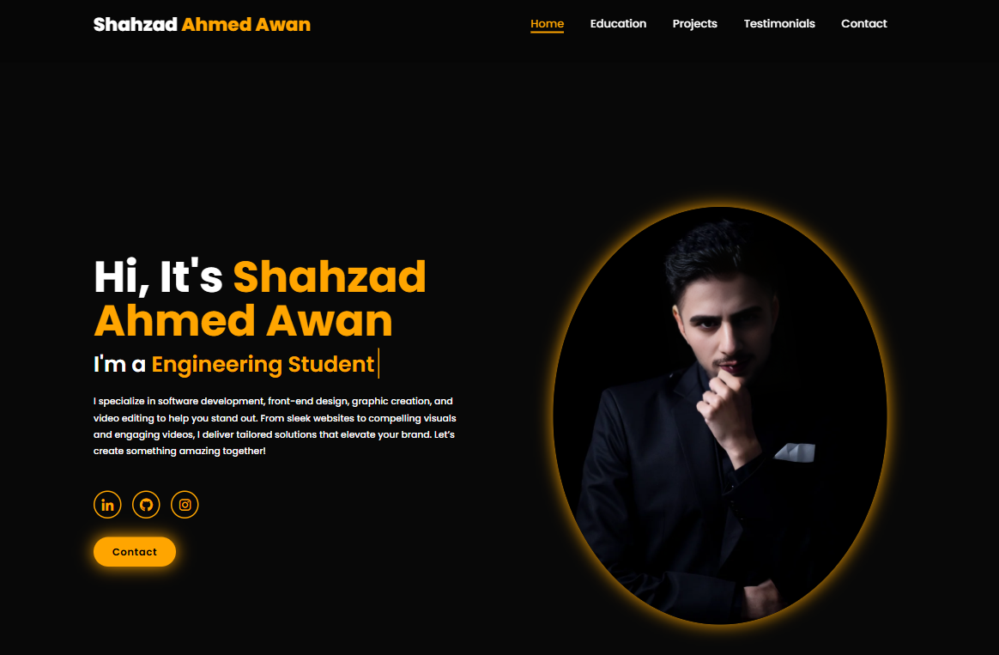

# 🚀 Personal Portfolio Website - Shahzad Ahmed Awan

Welcome to my **personal portfolio website**! This project highlights my skills, professional journey, and creative projects in **Software Engineering, Front-End Development, Graphic Design, and Video Editing**.

---

## 📑 Table of Contents

* [📸 Preview](#-preview)
* [✨ Features](#-features)
* [🛠️ Tech Stack](#-tech-stack)
* [📂 Project Structure](#-project-structure)
* [🚀 Getting Started](#-getting-started)
* [📬 Contact](#-contact)
* [👨‍💻 Author](#-author)

---

## 📸 Preview



---

## ✨ Features

* ✅ **Modern & Responsive Design** – Optimized for desktop and mobile devices.
* ✅ **Interactive UI** – Animations, hover effects, and smooth scrolling.
* ✅ **Dynamic JavaScript Functionalities:**

  * 🎨 Contact Button color change when clicked.
  * ✅ Real-time Form Validation.
* ✅ **Well-structured Codebase** – Clean HTML, CSS, and JavaScript.

---

## 🛠️ Tech Stack

| Language/Tool | Description           |
| ------------- | --------------------- |
| `HTML5`       | Markup Structure      |
| `CSS3`        | Styling & Layout      |
| `JavaScript`  | Interactivity & Logic |

---

## 📂 Project Structure

```
/Portfolio-Website
│
├── index.html
├── style.css
├── script.js
├── images/
└── README.md
```

---

## 🚀 Getting Started

1. **Clone this Repository:**

```bash
git clone https://github.com/your-username/portfolio-website.git
```

2. **Open `index.html` in your browser.**

3. **Explore the code and customize as needed.**

---

## 📬 Contact

Feel free to connect with me:

* 🔗 [LinkedIn](https://www.linkedin.com/in/shahzad-ahmed-awan-a803a9370)
* 📧 [Email](mailto:shahzadawan.official15@gmail.com)
* 🌐 [Visit My Portfolio](https://your-portfolio-link.com)

---

## 👨‍💻 Author

* **Author:** Shahzad Ahmed Awan
* **GitHub:** \[https://github.com/Shahzad-Ahmed-Awan]

---

🌟 If you liked this project, don’t forget to **star** the repository and follow me for more updates!